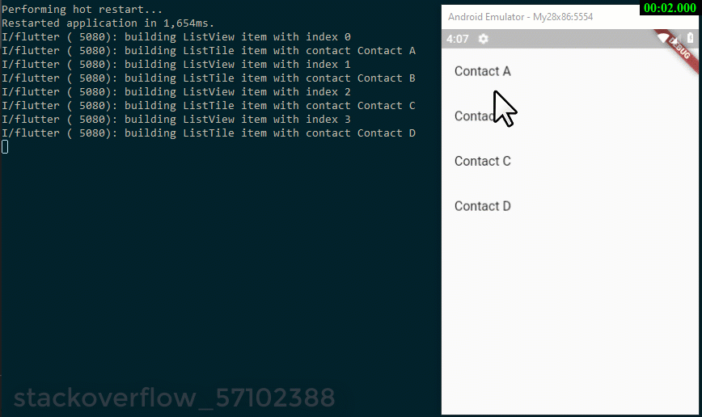

# e044_flutter_provider_2levels

## Based On Stack Overflow 57102388

- [flutter - Allow distinction between providers - Stack Overflow](https://stackoverflow.com/questions/57102388/allow-distinction-between-providers)

## Screen Record

## What

- ScaleTransition + AnimatedList for tasks in flutter Task app (e004)

- must run with :

  - [elrashid-flutter-examples/e002-aspcore-rest-api-server-for-flutter](https://github.com/elrashid-flutter-examples/e002-aspcore-rest-api-server-for-flutter)

## Step 1 :  extend Contact class with ChangeNotifier class

<!-- language: dart -->

    class Contact with ChangeNotifier {  }

## Step 2 :  remove final form **starred** field

<!-- language: dart -->

      bool starred;

## Step 3 :  move toggleStarred method form  AddressBookViewModel class to Contact  class

<!-- language: dart -->

      void toggleStarred() {
        starred = !starred;
        notifyListeners();
      }

-------

### Steps[1,2,3] Code Changes Review

<!-- language: dart -->

    class Contact with ChangeNotifier {
      final String name;
      bool starred;
      Contact(this.name, this.starred);

      void toggleStarred() {
        starred = !starred;
        notifyListeners();
      }
    }

-------

## Step 4 : move ListTile to sprate StatelessWidget called ContactView 

<!-- language: dart -->

    class ContactView extends StatelessWidget {
       Widget build(BuildContext context) {
        return ListTile();
      }
    }

## Step 5 : Change ListView itemBuilder method

<!-- language: dart -->

    (context, index) {
    return ChangeNotifierProvider.value(
      value: contacts[index],
      child: ContactView(),
    );

## Step 6 : on the new StatelessWidget ContactView get Contact using Provider

    final contact = Provider.of<Contact>(context);

## Step 7 :change onLongPress to use the new toggleStarred

<!-- language: dart -->

    onLongPress: () => contact.toggleStarred(),

-------

### Steps[4,6,7] Code Changes Review

<!-- language: dart -->

    class ContactView extends StatelessWidget {
      @override
      Widget build(BuildContext context) {
        final contact = Provider.of<Contact>(context);
        print("building ListTile item with contact " + contact.name);
        return ListTile(
          title: Text(contact.name),
          trailing: contact.starred ? Icon(Icons.star) : null,
          onLongPress: () => contact.toggleStarred(),
        );
      }
    }

#### Steps[5] Code Changes Review :

<!-- language: dart -->

    return ListView.builder(
      itemCount: contacts.length,
      itemBuilder: (context, index) {
        print("building ListView item with index $index");
        return ChangeNotifierProvider.value(
          value: contacts[index],
          child: ContactView(),
        );
      },
    );

-------

## Full Code

    import 'package:flutter/material.dart';
    import 'package:provider/provider.dart';

    void main() {
      runApp(
        ChangeNotifierProvider<AddressBookViewModel>(
          builder: (context) => AddressBookViewModel(),
          child: HomeScreen(),
        ),
      );
    }

    class HomeScreen extends StatelessWidget {
      @override
      Widget build(BuildContext context) {
        return ChangeNotifierProvider<AddressBookViewModel>(
          builder: (context) => AddressBookViewModel(),
          child: MaterialApp(
            home: Scaffold(
              body: _getBody(context),
            ),
          ),
        );
      }

      Widget _getBody(BuildContext context) {
        AddressBookViewModel vm = Provider.of<AddressBookViewModel>(context);

        final contacts = vm.contacts;
        return ListView.builder(
          itemCount: contacts.length,
          itemBuilder: (context, index) {
            print("building ListView item with index $index");
            return ChangeNotifierProvider.value(
              value: contacts[index],
              child: ContactView(),
            );
          },
        );
      }
    }

    // product_item.dart
    class ContactView extends StatelessWidget {
      @override
      Widget build(BuildContext context) {
        final contact = Provider.of<Contact>(context);
        print("building ListTile item with contact " + contact.name);
        return ListTile(
          title: Text(contact.name),
          trailing: contact.starred ? Icon(Icons.star) : null,
          onLongPress: () => contact.toggleStarred(),
        );
      }
    }

    class AddressBookViewModel with ChangeNotifier {
      final contacts = [
        Contact("Contact A", false),
        Contact("Contact B", false),
        Contact("Contact C", false),
        Contact("Contact D", false),
      ];
      void addcontacts(Contact contact) {
        contacts.add(contact);
        notifyListeners();
      }
    }

    class Contact with ChangeNotifier {
      final String name;
      bool starred;
      Contact(this.name, this.starred);

      void toggleStarred() {
        starred = !starred;
        notifyListeners();
      }
    }

## Ref :

- [Simple app state management - Flutter](https://flutter.dev/docs/development/data-and-backend/state-mgmt/simple)

- [[Question] Nested Providers and Lists · Issue #151 · rrousselGit/provider](https://github.com/rrousselGit/provider/issues/151)
